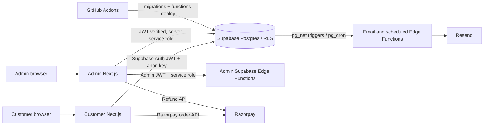
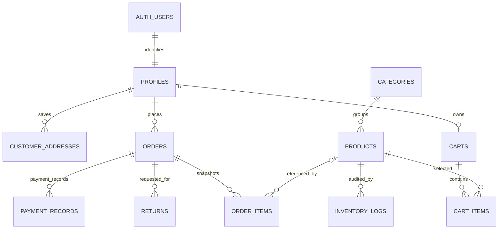
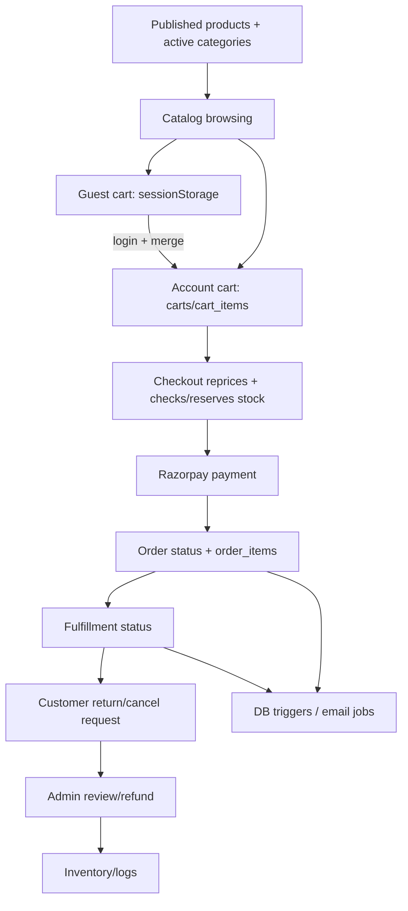

# E-commerce App — Codebase Knowledge

**Repository:** `jyoti-ai-generalist-portfolio/e-commerceApp`  
**Analysis snapshot:** 2026-10-09  
**Purpose:** Standalone implementation guide for engineers and coding agents making feature changes, fixing defects, or refactoring this repository.

> **Important reading note:** This repository contains two Next.js applications, a shared Supabase database and Edge Function deployment, and traces of more than one payment/email design. Treat the active route handlers and migrations as separate evidence; do not assume every SQL comment, README, or old Edge Function describes the current customer checkout path. The mismatch register in [Things You Must Know Before Changing Code](#things-you-must-know-before-changing-code) is essential context for payment, refunds, order email, and migrations.

## 1. High-Level Overview

### What this system does

This is a small-to-medium-business e-commerce platform intended to let a store publish a product catalog, accept customer registrations and orders, collect INR payments, manage fulfillment and returns, and monitor sales. The repository implements:

1. **Customer storefront** — product discovery, search/category filters, guest and signed-in carts, registration/login, addresses, checkout, order history/detail, cancellation and return requests.
2. **Admin portal** — Google-based admin login, dashboard KPIs/CSV export, product/category/stock operations, shipping status changes, and refund approval.
3. **Supabase backend** — PostgreSQL schema, Row Level Security (RLS), RPCs, database triggers, scheduled work, and Edge Functions for catalog operations and transactional email.
4. **Deployment support** — pnpm workspace, local Docker development, Vercel app configuration, and GitHub Actions deployment for Supabase changes.

The customer and admin applications are separate deployable Next.js App Router projects, not a single Next app: `ecommerce-customer/` and `ecommerce-admin/`. They share the database and Supabase project but have distinct UI/API code and authentication mechanisms.

### Main features and business value

| Feature | Business purpose | Main implementation |
|---|---|---|
| Product catalog and discovery | Let customers browse and find sellable inventory | `ecommerce-customer/app/page.jsx`, `/api/v1/products`, `/api/v1/categories`, `lib/catalogCache.js` |
| Customer accounts | Identify customers, persist profile/address and enable authenticated order history | Supabase Auth, `/api/v1/auth/*`, `components/auth/AuthModal.jsx` |
| Cart | Capture buying intent before checkout; merge guest intent after login | `lib/store/AppProviders.jsx`, `/api/v1/cart*`, `lib/guestCart.js` |
| Checkout and payment | Convert a cart into an order and collect payment | `/checkout`, `/api/v1/orders/create`, Razorpay SDK, `/api/v1/payments/verify` |
| Order history and returns | Make customer purchases visible and allow eligible self-service requests | `/account/orders`, `/orders`, `/api/v1/orders*`, `lib/orderRules.js` |
| Admin access | Restrict store operations to allowlisted Google identities | Google Identity Services verification, signed `admin_token` JWT, `admins` table |
| Catalog and stock management | Keep products, categories, prices, media and inventory current | Admin catalog UI + Supabase Edge Functions + `adjust_product_stock` RPC |
| Fulfillment and refunds | Track shipment progress and resolve cancellations/returns | Admin orders/returns pages, Next.js admin APIs, Razorpay refund API, SQL RPC |
| Sales monitoring | Give operators timely revenue, order, stock and export information | Admin dashboard metrics/export routes |
| Customer communications | Confirm orders, send shipping/return/refund messages, request reviews | Supabase triggers/cron + Resend Edge Functions; some Next.js email helpers |

### Technology stack

| Area | Technology and evidence |
|---|---|
| Monorepo | pnpm workspace with `ecommerce-admin` and `ecommerce-customer` packages (`pnpm-workspace.yaml`) |
| Web apps | Next.js App Router, React 18, mostly JavaScript/JSX, Tailwind CSS |
| Admin data viz | Recharts |
| Database/auth | Supabase Postgres, Supabase Auth, RLS, Storage, RPCs and Edge Functions (Deno/TypeScript) |
| Customer payment | Razorpay Node SDK and browser Checkout.js (`ecommerce-customer/lib/razorpayServer.js`, checkout component) |
| Admin identity | Google ID token verification (`google-auth-library`), `jsonwebtoken` app JWT |
| Email | Resend in Edge Functions; Nodemailer-based admin email helper; Resend in customer registration |
| Hosting/deploy | Vercel configurations in each app; GitHub Actions deploy Supabase migrations/functions |
| Local development | Docker Compose runs admin on port 3000 and customer on port 3001 |

Package versions are declared independently in each app's `package.json`. Customer is Next 14.2.13; admin is Next 14.2.15. The root `package.json` delegates dev/build/start/lint across the workspace.

### Repository layout

```text
.
├── ecommerce-customer/         Customer UI, Route Handlers, shared customer helpers
├── ecommerce-admin/            Admin UI, Route Handlers, admin auth and email
├── supabase/
│   ├── migrations/              Database schema and evolving payment/catalog/refund changes
│   └── functions/               Deno Edge Functions and shared helpers
├── .github/workflows/           Supabase CI/CD
├── docker-compose.yml           Two local app services
├── deployment-guide.md          Supabase deployment setup
├── environment-variables.md     Variable inventory (some sections are stale)
└── Schema_Markdown_Format.txt   Human-readable schema/policy summary (snapshot may drift)
```

### High-level architecture and data flow



#### Typical catalog-to-order flow

1. Customer browser loads category/product endpoints from the customer app.
2. Public Supabase reads use the anon key and depend on RLS policies exposing only active categories and published products.
3. Guest cart state is stored in `sessionStorage`; signed-in cart rows live in `carts`/`cart_items`, accessed with the caller's bearer JWT so `auth.uid()` policies apply.
4. Checkout requires a signed-in user. The server re-reads cart/product prices and stock, creates a draft order and order lines, reserves stock, creates a Razorpay order, and records the Razorpay order ID.
5. The browser receives Razorpay's payment result and posts the fields to the server verification endpoint; the endpoint verifies HMAC and updates order status.
6. Order pages query the caller's orders with explicit customer ID filtering plus RLS. Admin pages use privileged server/Edge clients after admin authentication.

**Caution:** Steps 4–5 describe the currently inspected customer Next.js route code. The later payment migration describes a different `payment_records` + `submit_payment_and_finalize` workflow that the route code does not call. See the mismatch register.

#### Cross-feature interactions

- Catalog publication controls public product visibility and whether checkout considers an item purchasable.
- Cart contents are converted into `order_items` at the checkout route; product price is reloaded server-side rather than accepted from the browser.
- Inventory is shared between customer checkout reservations and admin stock adjustments. Both are intended to use atomic `adjust_product_stock` RPC calls.
- Order shipping status changes drive customer-visible order status and, depending on which trigger path is deployed, shipping messages.
- Return eligibility depends on paid status, shipping status, `delivery_date`, and the active return-request set.
- Admin refund approval calls Razorpay first and then attempts to transition SQL order/return state. That SQL path has constraints/trigger inconsistencies documented below.

**STATE BLOCK — Phase 1**
- `INDEX_VERSION`: 1
- `FILE_MAP_SUMMARY`: Two Next.js apps, Supabase migrations/functions, root docs and deploy workflow; prioritized source index appears in §8.
- `OPEN_QUESTIONS`: Which of the parallel payment/email designs is deployed in the live Supabase project; exact production environment and migration history.
- `KNOWN_RISKS`: Stale documentation; active payment routes and later payment SQL do not appear aligned.
- `GLOSSARY_DELTA`: storefront, admin portal, RLS, RPC, Edge Function, guest cart, checkout.

## 2. Mid-Level Technical Notes

### Customer app

#### UI and state

- `ecommerce-customer/app/layout.jsx` wraps the app with shared providers and global styling.
- `ecommerce-customer/app/page.jsx` is the catalog landing page; it requests categories and paginated products, then renders `ProductGrid`.
- `ecommerce-customer/lib/catalogCache.js` is a module-scope in-memory cache. It survives client-side navigation within the loaded app and clears on a hard refresh; category/search/sort changes clear it.
- `ecommerce-customer/lib/store/AppProviders.jsx` owns the Supabase browser session, guest/authenticated cart state, cart refresh/merge, authentication modal state and toast messages. It is large and contains substantial commented-out earlier implementations; modify the active code paths only.
- Guest cart map is stored under `guest_cart_v1` in `sessionStorage` (`lib/guestCart.js`), so it is per-tab/session and intentionally not an account-persistent cart.
- Authenticated pages use access tokens from Supabase Auth, usually in `Authorization: Bearer …`. `lib/supabaseServer.js` validates tokens and makes per-user anon-key clients that forward the JWT.

#### Customer feature details

**Catalog.** `app/page.jsx` supports newest/price sorting, text search, category filters and pages of 50. `app/api/v1/products/route.js` selects published products, applies category/search/order filters, and returns `{ page, limit, total_items, total_pages, data }`. `app/api/v1/categories/route.js` is a supporting endpoint for active categories.

**Registration and login.** `app/api/v1/auth/register/route.js` checks email/password and required profile/address fields, signs up via Supabase Auth, inserts profile/address through a service-role client (needed if email confirmation means no new-user session exists), and attempts a welcome email. Email failures are logged but do not invalidate registration. Login uses Supabase password auth and returns the session; a service-role profile lookup differentiates unknown account from bad password to support the UI's sign-up hint (`app/api/v1/auth/login/route.js`). This creates an intentional email-enumeration signal as noted by the code's own comments.

**Cart.** `GET /api/v1/cart` returns empty cart for missing/invalid auth and otherwise formats the signed-in user's cart. `POST /api/v1/cart/items` adds/sets/deletes one product using the unique `(cart_id, product_id)` database constraint. `POST /api/v1/cart/merge` adds guest quantities into a persistent cart after sign-in; the browser clears guest storage only on a successful merge. The guest cart does not validate or reserve stock; checkout is the final stock check.

**Addresses.** `GET/POST /api/v1/addresses` and `PATCH/DELETE /api/v1/addresses/:id` operate on `customer_addresses`. Writes validate Indian PIN code (six digits) and mobile formats. Address labels/default are synthesized from creation order because the schema has no label/default columns. The checkout request stores the selected address as a JSON snapshot on the order.

**Checkout and payment.**

- `app/checkout/page.jsx` requires a logged-in session, collects an address, summarizes cart items and renders the Razorpay button.
- `components/checkout/RazorpayCheckoutButton.jsx` loads Razorpay Checkout.js, posts only the shipping address to order creation, then passes the gateway result to payment verification.
- `app/api/v1/orders/create/route.js` authenticates, fetches the current cart and joined products, rejects unpublished/out-of-stock products, recomputes amount, inserts a `pending_payment` order, inserts line-item price snapshots, reserves stock through the service role RPC, creates a Razorpay order in INR/paise and stores `razorpay_order_id`.
- `app/api/v1/payments/verify/route.js` confirms order ownership and Razorpay-order ID, verifies HMAC using the Razorpay key secret, then changes order status to `paid` and clears cart rows. A bad signature marks the order `payment_failed`.
- `app/api/v1/webhooks/razorpay/route.js` is the separate Razorpay webhook surface. It verifies the exact raw request body with `RAZORPAY_WEBHOOK_SECRET`; `payment.captured` and `order.paid` can mark a pending order paid and clear its cart. If an order was marked `payment_failed` by the abandoned-order flow, the webhook tries to re-reserve its saved line-item quantities; failure is intended to require manual refund. Although the header comment recommends subscribing to `payment.failed`, the handler does not process that event. This path is not interchangeable with the SQL payment-finalization routine.
- `lib/pricing.js` has configurable tax/shipping helpers, but the inspected checkout page and order-create endpoint each implement their own constants. See gotchas.

**Orders and returns.** Customer order pages call `GET /api/v1/orders` (pagination/filter), `GET /api/v1/orders/:id`, and `POST /api/v1/orders/:id/returns`. `lib/customerOrdersServer.js` centralizes token context, order field selection, error payload shape and response normalization. `lib/orderRules.js` defines a 7-day return window, allows cancellation for paid orders that are not delivered/cancelled and have no active request, and allows return only for delivered paid orders inside the window. Request kind is stored in a reason prefix (`[CANCEL] ` or `[RETURN] `), not a dedicated column. A rejected request does not prevent a new request.

### Admin app

#### Authentication and authorization

1. `/admin/login` obtains a Google ID token.
2. `POST /api/v1/admin/auth/google` verifies the token signature/audience through `google-auth-library`, looks up `admins.admin_email` case-insensitively, signs an eight-hour app JWT, and sets it in an `httpOnly`, `secure`, `sameSite=strict` cookie named `admin_token`.
3. `middleware.js` checks only that the cookie exists for `/admin/*` routes. This is a navigation guard, not an authorization boundary.
4. `/api/v1/admin/auth/me` verifies the JWT and rechecks the admin row by ID. `lib/requireAdmin.js` proxies this check for some APIs.
5. Some APIs verify the JWT directly; catalog management sends a service-role API key plus the app token as `X-Admin-Token` to Supabase Edge Functions, whose `_shared/adminAuth.ts` verifies token signature/role.

**Important:** Current admin authorization is not uniformly enforced. In particular, `auth/me` checks the current allowlist row, but direct-JWT routes and Edge Functions check signed token validity/role without rechecking that row. The cookie can therefore remain accepted by those code paths until expiry after allowlist revocation.

#### Admin feature details

**Dashboard.** `app/admin/dashboard/page.jsx` uses metrics endpoint `GET /api/v1/admin/dashboard/metrics` and export `GET /api/v1/admin/dashboard/export?format=csv`. Metrics aggregate orders in a date interval, compare to the prior interval, compute AOV and low-stock count, bucket revenue by day/week/month, and fetch five recent orders. The date parser currently constructs `Date` from query strings without rejecting invalid dates. Revenue inclusion excludes only status exactly `cancelled`, which should be considered when interpreting incomplete/refunded order states.

**Catalog.** `/admin/catalog` composes `CategoryGrid`, `ProductTable`, `ProductFormDrawer`, `ImageUploader` and `StockAdjuster`. `app/admin/catalog/api.js` calls `admin-categories`, `admin-catalog-products`, `admin-catalog-stock`, and `admin-media-upload` Edge Functions. Product deletion is soft (`is_published=false`); category deletion is soft (`is_active=false`). Stock adjustments are signed integer deltas and call `adjust_product_stock`, which enforces nonnegative stock and writes `inventory_logs`.

**Orders/fulfillment.** `GET /api/v1/admin/orders` lists paid undelivered orders and joins customer profiles. `PATCH /api/v1/admin/orders/:id/shipping-status` validates status and tracking number, checks paid/current status, uses compare-and-set on previous status to avoid competing updates, sets `delivery_date` on Delivered, and calls the admin app email helper. Database triggers may also try to send shipment/out-for-delivery email; avoid adding new email side effects without confirming which deployment is active.

**Returns/refunds.** `GET /api/v1/admin/returns` lists paged requests and enriches customer data. `POST /api/v1/admin/returns/:id/approve` finds a captured Razorpay payment, checks amount equality, calls Razorpay refund, then calls `approve_refund_restore` and sends email. The code explicitly handles “refund succeeded, database update failed” as a retryable-but-sensitive condition. The actual SQL state updates and trigger are inconsistent with declared status checks; see the risk register.

**Navigation stubs.** `AdminSidebar.jsx` links to `/admin/customers` and `/admin/settings`; no matching page implementation appeared in the repository scan. `/admin/catalog/page_1.jsx` is an additional catalog page artifact; inspect route conventions before treating it as active functionality.

### Supabase schema and relations



| Table | Role and important columns |
|---|---|
| `profiles` | Customer application profile, `id` FK to `auth.users`, unique email, optional name |
| `customer_addresses` | Customer saved address; UUID ID, owner `profile_id`, address fields; no schema field for label/default/state/country |
| `categories` | Unique name/slug and `is_active` soft-delete |
| `products` | Category FK, title/description, numeric price, stock/low-stock threshold, `image_urls` text array, publication flag |
| `carts` | One row per profile (`profile_id` unique) |
| `cart_items` | Product/quantity; unique `(cart_id, product_id)` in base migration |
| `orders` | Customer, amount, payment `status`, shipping status, address JSON snapshot, tracking, delivery/review fields; `razorpay_order_id` added later |
| `order_items` | Order line snapshot with `price_at_purchase`; nullable product FK preserves orders if product deleted |
| `returns` | Order, prefixed free-text reason, request status |
| `inventory_logs` | Product quantity change, reason, optional reference UUID |
| `admins` | Allowlist of admin email/name |
| `payment_records` | Added in checkout/payment migration; order, positive amount, globally unique `utr_number` |

Base relation definitions and constraints are in `supabase/migrations/001_schema.sql`; payment/address additions are in `supabase/migrations/20260924064815_checkout-and-payment.sql`; catalog additions in `20260916_catalog_management.sql`.

#### RLS model

- Public anonymous reads: published products and active categories.
- Customer-owned data: profiles, carts/cart items, order reads/inserts, order item reads, returns reads/inserts, and address CRUD use `auth.uid()` ownership predicates.
- `admins` and broad admin reads/writes are not exposed through customer RLS; admin server code/Edge Functions use service-role access after app-level checks.
- `payment_records` is customer-readable through its order ownership; writes are intended to be server-only through an RPC.
- RLS protects the browser anon key, but every service-role use bypasses these database policies and must remain on trusted server/Edge Function boundaries.

### API and external contract reference

#### Customer Route Handlers

| Method + path | Authentication | Purpose / response notes |
|---|---|---|
| `POST /api/v1/auth/register` | Public | Creates Supabase Auth account/profile/address; returns session or null if email confirmation is required |
| `POST /api/v1/auth/login` | Public | Password login; returns user/session or `user_exists` signal |
| `GET /api/v1/categories` | Public | `{ data: [{ id, name, slug }] }` for active categories |
| `GET /api/v1/products?page=&category_id=&search=&sort=` | Public | Paged published products; sort `newest`, `price_asc`, `price_desc`; page size 50 |
| `GET /api/v1/cart` | Bearer Supabase token or guest | Empty response for guest/invalid session; persisted item projection for valid user |
| `POST /api/v1/cart/items` | Bearer Supabase token | Body `{ product_id, quantity, action? }`; `action: "add"` increments, otherwise quantity sets; delete/zero removes |
| `POST /api/v1/cart/merge` | Bearer Supabase token | Body `{ guest_cart: [{ product_id, quantity }] }`; adds guest quantities to account cart |
| `GET /api/v1/addresses` | Bearer Supabase token | Saved addresses with synthetic ordinal label/default |
| `POST /api/v1/addresses` | Bearer Supabase token | Creates validated address |
| `PATCH /api/v1/addresses/:id` | Bearer Supabase token | Updates caller-owned address |
| `DELETE /api/v1/addresses/:id` | Bearer Supabase token | Deletes caller-owned address |
| `POST /api/v1/orders/create` | Bearer Supabase token | Body `{ shipping_address }`; server-side repricing/stock validation; returns order and Razorpay order IDs/amount/currency |
| `POST /api/v1/payments/verify` | Bearer Supabase token | Body `{ order_id, razorpay_order_id, razorpay_payment_id, razorpay_signature }`; checks ownership, binding and HMAC |
| `POST /api/v1/webhooks/razorpay` | Gateway signature | Razorpay webhook entrypoint; configure/validate separately from client verify |
| `GET /api/v1/orders?page=&limit=&status=` | Bearer Supabase token | Paged caller order list |
| `GET /api/v1/orders/:id` | Bearer Supabase token | Caller-owned normalized order |
| `POST /api/v1/orders/:id/returns` | Bearer Supabase token | Body `{ request_type: "CANCEL"|"RETURN", reason }`; returns 201 request or a coded eligibility error |

#### Admin Route Handlers

| Method + path | Auth / purpose |
|---|---|
| `POST /api/v1/admin/auth/google` | Verifies Google ID token, allowlists via `admins`, issues admin JWT/cookie |
| `GET /api/v1/admin/auth/me` | JWT + current `admins` row revalidation |
| `POST /api/v1/admin/auth/logout` | Clears admin cookie |
| `GET /api/v1/admin/dashboard/metrics?startDate=&endDate=` | JWT-gated KPI, series and recent order data |
| `GET /api/v1/admin/dashboard/export?format=csv&startDate=&endDate=` | JWT-gated CSV export |
| `GET /api/v1/admin/orders?page=` | Lists paid undelivered orders |
| `PATCH /api/v1/admin/orders/:id/shipping-status` | Updates fulfillment status/tracking; status body uses `order_shipping_status` |
| `GET /api/v1/admin/returns?page=&status=` | Lists return/cancel requests |
| `POST /api/v1/admin/returns/:id/approve` | Razorpay refund then SQL state update and customer email |

#### Supabase Edge Function endpoints

Admin functions are `admin-categories`, `admin-catalog-products`, `admin-catalog-stock`, and `admin-media-upload`. Their admin gate reads `X-Admin-Token`; their Supabase client uses service role. Catalog products support GET/POST/PUT/DELETE and paging/filtering; categories GET/POST/PUT/DELETE; stock PATCH with `{ delta, reason? }`; media upload accepts multipart field `file`, JPEG/PNG/WebP, maximum 5 MiB, and stores into public bucket `images`.

Database-triggered or scheduled functions:

| Function | Intended trigger / job | Effect |
|---|---|---|
| `order-confirmation` | New `orders` insert | Resend order email |
| `shipment-dispatched` | Transition to Shipped | Resend tracking email |
| `out-for-delivery` | Transition to Out for Delivery | Resend and optional push/SMS call |
| `delivered-review-request` | Daily pg_cron job | Delayed review email and `review_email_sent` flag |
| `return-request-notify` | New `returns` insert | Admin notification email |
| `refund-processed` | Intended refund status transition | Restocks order lines, logs inventory, emails customer |
| `stripe-webhook` | Stripe `checkout.session.completed` | Legacy separate order creation/deduction flow; not the customer app's Razorpay flow |

### Data-flow details and patterns

- **Customer database access:** browser uses public Supabase URL/anon key; server APIs either forward the user's JWT to RLS-aware anon client or explicitly use service role for narrowly trusted operations. Do not move service-role code into client components.
- **Admin data access:** Next.js admin endpoints instantiate a privileged Supabase client, while catalog Edge Functions construct their own service client. JWT checks precede privileged work but are uneven as described above.
- **Stock correctness:** `adjust_product_stock(product_id, delta, reason)` is the intended shared atomic/logged operation. Its SQL updates product quantity and inserts an inventory log, and rejects resulting negative quantity.
- **External payment:** browser gets only public Razorpay key ID; key secret is server-side for creating gateway orders and verifying checkout HMAC. Webhook signing uses a distinct `RAZORPAY_WEBHOOK_SECRET`.
- **Email and triggers:** SQL calls `public.call_edge_function()` via pg_net using values retrieved from Vault. Edge Functions use shared Resend helper in `supabase/functions/_shared/resend.ts`. Some admin status/refund endpoints separately send mail from the Next app.
- **Deploy:** `.github/workflows/deploy-supabase.yml` triggers on pushes to `main` that touch `supabase/**`, links using GitHub secrets, runs `supabase db push`, then deploys all functions. It does not run application tests/builds.

**STATE BLOCK — Phase 2**
- `INDEX_VERSION`: 1
- `FILE_MAP_SUMMARY`: Source inventory in §8 covers both app surfaces, SQL, CI and high-impact functions.
- `OPEN_QUESTIONS`: Which admin API auth surface should be canonical; whether database triggers/cron and Edge Function secrets are deployed as checked in.
- `KNOWN_RISKS`: Service-role blast radius; duplicate email side effects; system has both app APIs and DB-triggered effects.
- `GLOSSARY_DELTA`: anon key, service role, pg_net, pg_cron, bearer token, admin allowlist, compare-and-set.

## 3. Deep Reference

### Feature-by-feature relationship map



### State and business rules to preserve

#### Customer/return rules

- Cart is not itself a stock reservation; stock is validated during server-side checkout.
- Checkout requires a valid customer session and shipping address; guest checkout is not implemented.
- Order price and availability come from database product rows at checkout, not browser-sent price.
- Cancellation/return requests require an order with payment `status === "paid"`.
- Cancellation is blocked after Delivered or Cancelled and if an active request exists.
- Returns require `order_shipping_status === "Delivered"`, a non-future delivery date within 7 days, and no active request.
- Active request statuses in `lib/orderRules.js`: `Requested`, `Approved`, `Refunded`; `Rejected` does not block resubmission.
- Request type is encoded in reason prefix. A future schema/API migration to a dedicated request-type field must update API, UI parsing and admin listing together.
- Product deletion is non-destructive/unpublishing; category deletion is deactivation; order lines may retain a null product FK if product rows are physically removed.

#### Payment and inventory concepts

There are three distinct mechanisms in repository history/current code:

1. **Current customer Route Handler path:** creates `pending_payment` order and line snapshots, reserves stock before contacting Razorpay, then payment verification updates to `paid` and empties the cart.
2. **Later SQL payment path:** `payment_records` plus `submit_payment_and_finalize` is documented to accept captured payments atomically and create order lines/deduct stock at finalization. It anticipates partial payments and stock-conflict statuses.
3. **Legacy Stripe Edge Function:** constructs an order from Stripe session metadata, decrements stock with legacy RPC, and clears cart. It uses statuses/field assumptions that differ from the current order schema.

Before implementing retries, refunds, idempotency, reconciliation, or webhook behavior, establish which of these versions is production-authoritative and converge server routes, RPC contract, schema constraints, webhook, and user-facing states.

### Database migrations in sequence

| File | Intended role | Notes |
|---|---|---|
| `supabase/migrations/001_schema.sql` | Core tables, relationships, indexes, timestamps, RLS baseline | Includes unique cart/product constraint, base order status check, and customer-owned policies |
| `supabase/migrations/002_triggers.sql` | HTTP trigger helper, order/shipping/return notifications, review cron, stock RPCs | Contains Vault setup and status checks; verify project-specific setup and trigger predicates before deployment |
| `supabase/migrations/20260916_catalog_management.sql` | Category active flag/policy and atomic stock update RPC | Source calls out category soft-delete and atomic stock increments |
| `supabase/migrations/20260924064815_checkout-and-payment.sql` | Razorpay order column, payment_records, payment RPC/status helper, address RLS, reservations/abandoned-order release | The described function lifecycle and status check need reconciliation with active customer routes |
| `supabase/migrations/20260929051200_approve_refund_restore.sql` | `approve_refund_restore` privileged RPC | Updates payment and shipping statuses that do not match earlier declared checks; name/comment imply restoration triggered asynchronously |

Do not infer that checked-in migrations have run in production. Review Supabase migration history and deployed schema before adding or editing migrations; migrations mutate shared data and DB constraints.

### External APIs and configuration

#### Supabase

- Public app variables: `NEXT_PUBLIC_SUPABASE_URL`, `NEXT_PUBLIC_SUPABASE_ANON_KEY`.
- Server-only key: `SUPABASE_SERVICE_ROLE_KEY`; bypasses RLS and must never be exposed to browser bundle.
- Customer server helper: `ecommerce-customer/lib/supabaseServer.js`.
- Admin privileged helper: `ecommerce-admin/lib/supabaseClient.js`.
- Edge Functions read `SUPABASE_URL` and `SUPABASE_SERVICE_ROLE_KEY` at runtime.

#### Razorpay

- Checkout public key: `NEXT_PUBLIC_RAZORPAY_KEY_ID`.
- Server API key pair: `RAZORPAY_KEY_ID`, `RAZORPAY_KEY_SECRET`.
- Webhook signature secret: `RAZORPAY_WEBHOOK_SECRET`.
- Amounts sent to Razorpay are in paise (`rupees * 100`).
- Admin refunds require fetching payments associated with a Razorpay order; only full-amount payment matches are accepted in the current admin route.

#### Google/admin JWT

- Google client audience: `NEXT_PUBLIC_GOOGLE_CLIENT_ID` in the admin app.
- Admin app JWT secret: `JWT_SECRET`; Edge Functions also need the same signing/verification secret.
- Cookie `admin_token`, eight-hour expiry.
- Admin identity must have matching row in `admins`.

#### Email and deployment

- Resend Edge Function secrets: `RESEND_API_KEY`, `STORE_FROM_EMAIL`; return notification additionally expects `STORE_ADMIN_EMAIL`.
- Optional `PUSH_PROVIDER_URL` / `PUSH_PROVIDER_KEY` are used by out-for-delivery function.
- GitHub Actions needs `SUPABASE_ACCESS_TOKEN`, `SUPABASE_PROJECT_REF`, and `SUPABASE_DB_PASSWORD`.
- Admin `ecommerce-admin/.env.example`, customer `ecommerce-customer/.env.example`, root `environment-variables.md`, and deployment instructions should be cross-checked: `environment-variables.md` includes older Vite/Stripe variable names while the apps are Next.js/Razorpay.

### Things You Must Know Before Changing Code

This section reports code/documentation inconsistencies visible in the repository. It is not a claim about current production state.

| Priority | Observation | Why it matters / files to reconcile |
|---|---|---|
| P0 | **Payment lifecycle divergence.** Customer order-create and verify routes do not call `submit_payment_and_finalize` or write `payment_records`; they reserve stock during order creation and mark status paid on signature verification. Later migration says payment records are the authoritative idempotent finalizer. | Double-decrement risk if both paths are combined; refunds cannot reliably find a stored payment ID; payment records will be absent. Reconcile `ecommerce-customer/app/api/v1/orders/create/route.js`, `payments/verify/route.js`, Razorpay webhook, and payment migration before changing checkout. |
| P0 | **Refund SQL values conflict with SQL checks.** Base/payment migration allows order statuses `pending_payment`, `paid`, `payment_failed`, `payment_refunded`; refund RPC writes `refunded`. Shipping check permits `Processing`, `Shipped`, `Out for Delivery`, `Delivered`, `Cancelled`; refund RPC can write `Returned`. | Depending on actual deployed constraint names/state, the refund RPC can fail after Razorpay has issued a refund. Check/reconcile migration constraints, RPC, and route error handling. |
| P0 | **Refund trigger predicate does not match returns status vocabulary.** `returns.status` constraint is `Requested/Approved/Rejected/Refunded`; RPC sets `Refunded`; trigger function in `002_triggers.sql` watches for `payment_refunded`. | The SQL-triggered `refund-processed` function is not invoked by the RPC's `Refunded` transition as written; intended stock restoration from that function will not happen through this trigger. Admin route comments also claim the RPC restores stock, but the inspected SQL RPC does not contain a restocking loop. |
| P1 | **Razorpay webhook and browser verify are distinct paths.** Both can observe payment; the current handlers use order status checks for partial idempotency but neither stores the Razorpay payment ID or funnels through the migration's payment RPC. The webhook also does not handle `payment.failed` despite its setup comment. | Reconciliation/audit gaps and divergent retry behavior; migration comments about a shared payment RPC do not describe current handler wiring. |
| P1 | **Webhook stock-conflict log references an undefined `payment` variable.** In the `payment_failed` reconciliation branch, the code has `paymentEntity` but interpolates `payment.id`. | If stock cannot be re-reserved, interpolation throws before the intended error log and order update; outer catch returns 500 and relies on webhook retries, without initiating a refund. |
| P1 | **Payment status constraint vs later RPC states.** `submit_payment_and_finalize` emits `partial_paid` and `payment_failed_stock`, while migration's visible order status check does not include those values. | Partial/stock conflict behavior can raise a check violation rather than return its documented JSON status. |
| P1 | **Migration SQL has apparent syntax/constraint-name defects.** `20260916_catalog_management.sql` contains a standalone `-` line; `20260924064815_checkout-and-payment.sql` has adjacent `ALTER TABLE` statements without a semicolon after the shipping-constraint `DROP`. `002_triggers.sql` also drops/reuses `orders_status_check` for a condition on `order_shipping_status`, mixing payment and fulfillment constraints. | A clean migration replay may fail or leave different constraints than comments imply. Validate each migration against a local Supabase database and inspect exact deployed constraint names before depending on them. |
| P1 | **Totals disagree by implementation.** `app/checkout/page.jsx` and `orders/create/route.js` use 18% tax, free shipping at ₹5,000 and ₹99 below threshold. `lib/pricing.js` defaults to 18% and shipping slabs ₹100/₹50/free at different thresholds. | The displayed and server-calculated amounts can differ. The server route is the charge amount source; use one shared server-authoritative rule and align UI. |
| P1 | **Email paths may duplicate or fire at the wrong lifecycle point.** New order inserts invoke the SQL `trg_order_placed` function, while Next.js admin status updates also send shipping emails and the DB has shipment triggers. `order-confirmation` is keyed to order insertion, which currently creates a `pending_payment` draft before payment. | Customers may receive duplicate or pre-payment messages, and Edge Function execution can race the subsequent line inserts. Confirm desired event semantics and deployed trigger state. |
| P1 | **Order confirmation Edge Function uses email/currency content unrelated to app conventions.** It formats amounts with `$` while checkout stores INR; it assumes lines/profile join and current row timing. | Customer communications may be misleading or fail depending on partial order state. |
| P1 | **Admin allowlist revocation behavior differs by endpoint.** Middleware only checks cookie existence; `auth/me` checks the allowlist row; direct-JWT dashboard/export and Edge Functions validate signature/role but do not re-query `admins`. | Removing an admin does not uniformly revoke privileges immediately; a still-valid token may continue on routes that skip `auth/me`. |
| P1 | **Raw admin Google token is logged.** `auth/google/route.js` logs the request body. | ID tokens are bearer credentials and should not appear in logs. Avoid logging auth payloads; audit existing log retention. |
| P1 | **Database migration setup contains environment-specific/sensitive setup patterns.** `002_triggers.sql` has fixed project URL/Vault setup and fallback authorization behavior in `call_edge_function`. | A migration copied to another project can call the wrong URL or use unsafe fallback semantics. Review the actual checked-in values privately, do not copy them into docs/issues, and replace project-specific setup with deployment-time secret handling. |
| P1 | **Email HTML interpolates database values.** Several Edge Functions interpolate name, product title, reason, tracking number into HTML without escaping. | User-controlled fields can become markup in email. Escape inserted values or use a safe templating strategy when touching these templates. |
| P1 | **Razorpay external refund and database update cannot share a transaction.** Admin API refunds first, then calls SQL RPC; its explicit retry message says not to issue a second refund. | Reconciliation/idempotency must remain explicit and auditable. Do not treat HTTP failure as proof no refund occurred. |
| P2 | **Docs/schema artifacts have drift.** Customer README describes checkout as out-of-scope and claims no cart unique constraint, while migrations include checkout and a unique constraint. Admin README says catalog/orders are follow-up use cases although pages/functions exist. Root environment guide describes Vite/Stripe. | Documentation is not authoritative for deployed code; update the directly related docs when modifying these surfaces. |
| P2 | **Navigation points to missing sections.** Sidebar links Customers/Settings; no corresponding page surfaced in the app tree. | Users can reach dead routes; don't assume customer management/settings exist. |
| P2 | **Duplicate/stale UI files and commented code.** `page_1.jsx` exists beside catalog `page.jsx`; `AppProviders.jsx`, cart and order route files contain commented older implementations. | Identify Next's active route and current code before editing; avoid copying legacy logic into the active path. |
| P2 | **Runtime cache is per frontend process/page lifecycle.** Catalog cache is in-memory, not shared or durable. | It is an optimization for SPA navigation, not a source of truth or cross-user/server cache. |
| P2 | **Potential data-volume scaling.** Dashboard loads all period orders and all products into Node to aggregate KPIs; CSV export reads the matching order set without pagination. | Large catalogs/history will increase memory/query time; consider database aggregation and streaming/paged exports when scale requires it. |
| P2 | **CI is deployment-only.** Workflow pushes migrations and deploys functions but does not build/lint apps or run tests. Repository scan did not find test/spec files. | Do not interpret a green deployment as application validation; add/run targeted checks when changing code. |

### Architectural conventions

- Keep Next Route Handlers as the application server boundary; use typed/validated inputs and explicit HTTP statuses.
- Customer-owned reads/writes should use JWT-scoped anon clients and RLS; add explicit `.eq(customer_id/profile_id, user.id)` filters where applicable as defense in depth.
- Service-role clients belong only in server-only files, routes or Edge Functions. Use them for narrow operations and never bundle them into client components.
- Mutations that affect money/inventory should be idempotent, atomic at the database boundary, and logged. `adjust_product_stock` is the preferred stock RPC pattern, but payment/refund flows need a unified source of truth.
- Prefer soft-delete fields already in use (`is_published`, `is_active`) to physical removal for catalog entities.
- For admin Route Handlers, use `requireAdmin` where possible but verify whether it enforces allowlist freshness; direct JWT verification alone is weaker.
- Keep API/SQL/domain status vocabularies synchronized. Status strings are case-sensitive and current code has multiple conventions.
- Customer route errors vary: order helper routes return `{ error, code }`; other endpoints generally return `{ error }`. Preserve existing consumer expectations or normalize deliberately.

### Glossary

| Term | Meaning in this repository |
|---|---|
| Admin allowlist | `admins` table rows whose email is allowed to receive admin JWTs |
| Admin token | Signed app JWT, stored in `admin_token` cookie and forwarded to catalog Edge Functions |
| Anon key | Public Supabase key; RLS is expected to constrain its database access |
| Cart merge | Add guest `sessionStorage` quantities into the signed-in user's persistent cart |
| Edge Function | Deno TypeScript HTTP function deployed within Supabase |
| Guest cart | Per-tab browser cart in `sessionStorage`; no account or DB row until login |
| Inventory reservation | Decrement stock when the current customer create-order route creates a pending order |
| Order status | Payment lifecycle value in `orders.status`, distinct from shipping state |
| Shipping status | Fulfillment state in `orders.order_shipping_status` |
| RLS | Supabase/Postgres row policies using `auth.uid()` for per-customer access |
| RPC | Postgres function invoked through Supabase `.rpc(...)` |
| Service role | Privileged Supabase key that bypasses RLS; server/Edge-only |
| Soft delete | Retain catalog row but make it invisible using `is_published=false` or `is_active=false` |
| Return request | Customer cancellation/return row in `returns`; kind currently encoded in `reason` prefix |
| Razorpay order ID | Gateway-side order identifier saved on `orders` to bind checkout verification/refund to app order |
| `payment_records.utr_number` | Unique field used by later SQL payment RPC as the payment idempotency token; distinguish it from Razorpay payment IDs |

### Assumptions and confidence

| Assumption / conclusion | Confidence | Evidence / limit |
|---|---:|---|
| The intended customer locale/currency is India/INR | High | Indian phone/PIN validators, `en-IN` formatting, Razorpay INR |
| Checkout is intended for signed-in customers only | High | Checkout redirects guests; `orders.customer_id` is non-null |
| Current customer app checkout is Razorpay-backed | High | Active route/component source inspected |
| The Stripe Edge Function is legacy/separate from current checkout | High | It is the only Stripe checkout path found; current browser/API use Razorpay |
| Live Supabase constraints match the checked-in migration files | Low | Runtime project/schema inaccessible; migration history not inspected |
| All documented email triggers are currently installed/enabled | Low | Source is present; deployment/config state cannot be proven from this repo |
| Catalog API edge functions are used by the current admin UI | High | `app/admin/catalog/api.js` calls those exact function names |

**STATE BLOCK — Phases 3–5**
- `INDEX_VERSION`: 1
- `FILE_MAP_SUMMARY`: §8 lists the highest-value 50 files; feature/API/schema details above cite source-relative paths.
- `OPEN_QUESTIONS`: Production payment provider/path; actual deployed migrations and Vault/cron configuration; expected refund and notification semantics.
- `KNOWN_RISKS`: Inconsistent payment/status contracts, refund trigger mismatch, potentially stale admin authorization, differing totals, legacy credentials/URLs in migration setup, unescaped HTML.
- `GLOSSARY_DELTA`: reservation, idempotency token, payment lifecycle, shipping lifecycle, soft delete, signed admin JWT.
- `NEXT_STEPS`: Before code changes to payments/refunds/email, inspect deployed database constraints/triggers and gateway webhook configuration; then consolidate the authoritative lifecycle and update the customer/admin UX and docs together.

## 8. File Index (Pass 0)

Paths are relative to repository root. `HASH8` is the first eight lowercase hexadecimal characters of SHA-256 at the analysis snapshot; changes to any listed file invalidate its hash and may invalidate line anchors. Priority is relative implementation importance, not a security severity rating.

| # | Priority | Path | Type | Lines | HASH8 | Notes |
|---:|:---:|---|---|---:|---|---|
| 1 | P0 | `ecommerce-customer/app/api/v1/orders/create/route.js` | JS Route Handler | 151 | `b5f0d559` | Server-side checkout, reservation and Razorpay order |
| 2 | P0 | `ecommerce-customer/app/api/v1/payments/verify/route.js` | JS Route Handler | 68 | `d5a7e3a3` | Signature verification and order paid/cart clear |
| 3 | P0 | `ecommerce-admin/app/api/v1/admin/returns/[id]/approve/route.js` | JS Route Handler | 77 | `89941e80` | External refund then privileged DB RPC |
| 4 | P0 | `supabase/migrations/20260924064815_checkout-and-payment.sql` | SQL migration | 326 | `be221bee` | Payment RPC and reservation migrations |
| 5 | P0 | `supabase/migrations/20260929051200_approve_refund_restore.sql` | SQL migration | 36 | `4260e270` | Refund/cancel state transition RPC |
| 6 | P0 | `supabase/migrations/001_schema.sql` | SQL migration | 266 | `7460e653` | Main database schema, checks and RLS |
| 7 | P0 | `supabase/migrations/002_triggers.sql` | SQL migration | 185 | `fd6b978d` | Trigger-driven side effects and stock RPCs |
| 8 | P0 | `ecommerce-customer/app/api/v1/webhooks/razorpay/route.js` | JS Route Handler | 186 | `df193b11` | Gateway webhook path |
| 9 | P0 | `ecommerce-customer/lib/supabaseServer.js` | JS server helper | 48 | `d09bb702` | Anon/authenticated/service-role clients |
| 10 | P0 | `ecommerce-admin/lib/jwt.js` | JS auth helper | 33 | `99726272` | Admin JWT signing and validation |
| 11 | P0 | `ecommerce-admin/app/api/v1/admin/auth/google/route.js` | JS Route Handler | 105 | `d00e09de` | Google verification and admin allowlist login |
| 12 | P0 | `ecommerce-admin/app/api/v1/admin/auth/me/route.js` | JS Route Handler | 56 | `b81c3b2a` | Session validation and live admin row check |
| 13 | P1 | `ecommerce-customer/lib/store/AppProviders.jsx` | JSX context | 789 | `266d078d` | Auth, cart, guest merge, toasts |
| 14 | P1 | `ecommerce-customer/lib/orderRules.js` | JS domain helper | 43 | `5a9b23a1` | Cancellation/return policy |
| 15 | P1 | `ecommerce-customer/lib/customerOrdersServer.js` | JS server helper | 54 | `58444ec7` | Customer auth/query/normalization |
| 16 | P1 | `ecommerce-customer/app/api/v1/orders/[id]/returns/route.js` | JS Route Handler | 67 | `701b526d` | Return request validation/eligibility |
| 17 | P1 | `ecommerce-customer/app/api/v1/orders/route.js` | JS Route Handler | 86 | `93191d94` | Customer order list |
| 18 | P1 | `ecommerce-customer/app/api/v1/orders/[id]/route.js` | JS Route Handler | 58 | `4376cdd9` | Customer order detail |
| 19 | P1 | `ecommerce-customer/app/checkout/page.jsx` | JSX page | 161 | `2bc7ff47` | Checkout UX/totals |
| 20 | P1 | `ecommerce-customer/components/checkout/RazorpayCheckoutButton.jsx` | JSX component | 115 | `61a1d504` | Browser payment integration |
| 21 | P1 | `ecommerce-customer/lib/razorpayServer.js` | JS server helper | 55 | `09faa392` | Razorpay create/signature verification |
| 22 | P1 | `ecommerce-customer/app/api/v1/cart/items/route.js` | JS Route Handler | 122 | `18538309` | Persistent cart mutation |
| 23 | P1 | `ecommerce-customer/app/api/v1/cart/merge/route.js` | JS Route Handler | 73 | `c9bc7a94` | Guest-to-account merge |
| 24 | P1 | `ecommerce-customer/app/api/v1/auth/register/route.js` | JS Route Handler | 116 | `4b79eb13` | Auth/profile/address/email side effects |
| 25 | P1 | `ecommerce-customer/app/api/v1/auth/login/route.js` | JS Route Handler | 50 | `185b2f0f` | Auth plus account-existence hint |
| 26 | P1 | `ecommerce-customer/app/api/v1/addresses/route.js` | JS Route Handler | 86 | `8295d32d` | Address CRUD create/list |
| 27 | P1 | `ecommerce-customer/app/api/v1/addresses/[id]/route.js` | JS Route Handler | 80 | `3f1543f6` | Address update/delete |
| 28 | P1 | `ecommerce-customer/app/api/v1/products/route.js` | JS Route Handler | 45 | `ff87cf58` | Public product search/sort/paging |
| 29 | P1 | `ecommerce-customer/app/page.jsx` | JSX page | 191 | `3622e9a9` | Catalog landing page |
| 30 | P1 | `ecommerce-customer/lib/pricing.js` | JS domain helper | 60 | `9f1cccee` | Configurable price/tax/shipping functions |
| 31 | P1 | `ecommerce-admin/app/api/v1/admin/orders/[id]/shipping-status/route.js` | JS Route Handler | 49 | `d5375ff7` | Fulfillment state and email |
| 32 | P1 | `ecommerce-admin/app/api/v1/admin/dashboard/metrics/route.js` | JS Route Handler | 126 | `7a3b6e19` | KPI and chart aggregation |
| 33 | P1 | `ecommerce-admin/app/api/v1/admin/dashboard/export/route.js` | JS Route Handler | 59 | `7551a5d6` | CSV export |
| 34 | P1 | `ecommerce-admin/app/api/v1/admin/orders/route.js` | JS Route Handler | 32 | `82784c01` | Admin order list |
| 35 | P1 | `ecommerce-admin/app/api/v1/admin/returns/route.js` | JS Route Handler | 39 | `33743da6` | Admin returns list |
| 36 | P1 | `ecommerce-admin/middleware.js` | JS middleware | 23 | `19454d00` | Admin-page cookie presence gate |
| 37 | P1 | `ecommerce-admin/lib/requireAdmin.js` | JS server helper | 25 | `08063331` | Route auth proxy |
| 38 | P1 | `ecommerce-admin/lib/googleAuth.js` | JS auth helper | 31 | `c72681fd` | Google ID token verification |
| 39 | P1 | `ecommerce-admin/app/admin/catalog/api.js` | JS server actions | 129 | `4d086256` | Admin catalog Edge Function client |
| 40 | P1 | `supabase/functions/_shared/adminAuth.ts` | Deno/TS helper | 45 | `dcdd6428` | Edge Function admin token gate |
| 41 | P1 | `supabase/functions/admin-catalog-products/index.ts` | Deno/TS Edge Function | 171 | `057c5a54` | Product CRUD and validation |
| 42 | P1 | `supabase/functions/admin-categories/index.ts` | Deno/TS Edge Function | 146 | `3116f1bf` | Category CRUD and soft delete |
| 43 | P1 | `supabase/functions/admin-catalog-stock/index.ts` | Deno/TS Edge Function | 76 | `d4b1f8c2` | Atomic inventory changes |
| 44 | P1 | `supabase/functions/admin-media-upload/index.ts` | Deno/TS Edge Function | 84 | `73d23e3e` | Public product media upload |
| 45 | P1 | `supabase/functions/refund-processed/index.ts` | Deno/TS Edge Function | 50 | `a0130054` | Restock and refund email |
| 46 | P1 | `supabase/functions/stripe-webhook/index.ts` | Deno/TS Edge Function | 96 | `aaed25e4` | Legacy Stripe order creation path |
| 47 | P1 | `supabase/functions/order-confirmation/index.ts` | Deno/TS Edge Function | 54 | `b07a960b` | Triggered order email |
| 48 | P1 | `ecommerce-customer/app/api/v1/cart/route.js` | JS Route Handler | 46 | `a593c0fb` | Cart read/hydration |
| 49 | P2 | `ecommerce-customer/lib/catalogCache.js` | JS helper | 17 | `2e0aebda` | Per-page catalog cache |
| 50 | P2 | `ecommerce-customer/components/auth/AuthModal.jsx` | JSX component | 286 | `09dc2200` | Customer auth UI |

## 9. Feature-to-source quick map

| Change area | Start here | Follow through |
|---|---|---|
| Catalog discovery | `ecommerce-customer/app/page.jsx` | `app/api/v1/products/route.js`, `categories/route.js`, `lib/catalogCache.js`, `components/ProductGrid.jsx` |
| Customer login/signup | `components/auth/AuthModal.jsx` | `lib/store/AppProviders.jsx`, `app/api/v1/auth/*`, `lib/supabaseServer.js`, `lib/resend.js` |
| Cart | `lib/store/AppProviders.jsx` | `lib/guestCart.js`, cart Route Handlers, base cart RLS/unique constraint |
| Checkout/payment | `app/checkout/page.jsx` | order create, verify, Razorpay webhook/helper, payment migrations, refund endpoint |
| Customer orders/returns | `app/account/orders/page.jsx` | order API routes, `lib/customerOrdersServer.js`, `lib/orderRules.js` |
| Admin auth | `app/admin/login/page.jsx` | Google auth route/helper, JWT helper, `auth/me`, middleware, `admins` schema |
| Admin dashboard | `app/admin/dashboard/page.jsx` | metrics/export endpoints, order/profile schema |
| Catalog admin | `app/admin/catalog/page.jsx` | `api.js`, catalog components, Edge Functions, catalog migration |
| Fulfillment | `app/admin/orders/page.jsx` | admin order/status APIs, `mailer.js`, shipping triggers and email functions |
| Refunds | `app/admin/returns/page.jsx` | returns APIs, Razorpay admin helper, refund SQL function, return/refund triggers |
| Email/background effects | SQL triggers and cron | `supabase/functions/*`, shared Resend client, variable/deploy docs |

## 10. Decisions, open questions, and next steps

### Findings

- This is an implemented multi-app platform, not merely the limited starter described by several older READMEs.
- The customer application is the source of truth for the currently wired Razorpay storefront journey; the database contains a later payment-finalization design and an older Stripe function that require alignment.
- Admin catalog operations are implemented in Supabase Edge Functions, while dashboard/orders/returns operations are Next.js server routes.
- Authorization and data isolation are split across Supabase RLS, service-role server clients, app JWT checks, and middleware; each access path needs its own verification.
- There is no test/spec file matching conventional `*.test.*` or `*.spec.*` patterns in the repository scan. Root lint/build scripts exist, but the Supabase workflow only deploys.

### Open questions requiring repository-owner or environment confirmation

1. Is the intended production payment provider only Razorpay, or is Stripe also deployed for a separate checkout?
2. Does production call the SQL `submit_payment_and_finalize` RPC, or is the checked-in customer Route Handler flow deployed?
3. What are the live order and return check constraints, active triggers, cron schedules and migration history?
4. Should admin revocation take effect immediately on every API/Edge Function request?
5. Should transactional email be driven exclusively by database triggers, exclusively by Next.js handlers, or intentionally split by event?
6. What is the single source of truth for GST and shipping slabs?
7. Are customer management and settings routes intentionally unimplemented, or do they exist outside this repository?

### Suggested safe change sequence for cross-cutting work

1. Verify production database schema/trigger state and payment gateway webhook configuration before changing money-related flows.
2. Choose one authoritative payment lifecycle and status vocabulary; align SQL constraints, customer routes, webhook, admin refund API, email triggers and UI states.
3. Add focused automated tests around price calculation, checkout idempotency, signature handling, inventory conflicts, return eligibility and refund retry/reconciliation.
4. Standardize admin authorization and allowlist revalidation across Next.js routes and Edge Functions.
5. Consolidate price calculation and email side effects; escape HTML template values.
6. Update stale app/deployment/environment documentation and run targeted app builds/lints plus Supabase migration validation.
